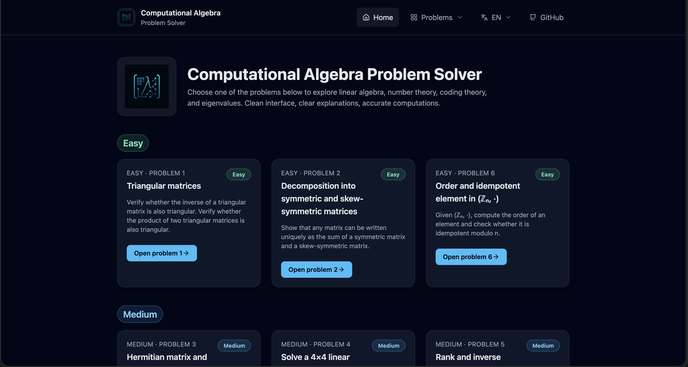
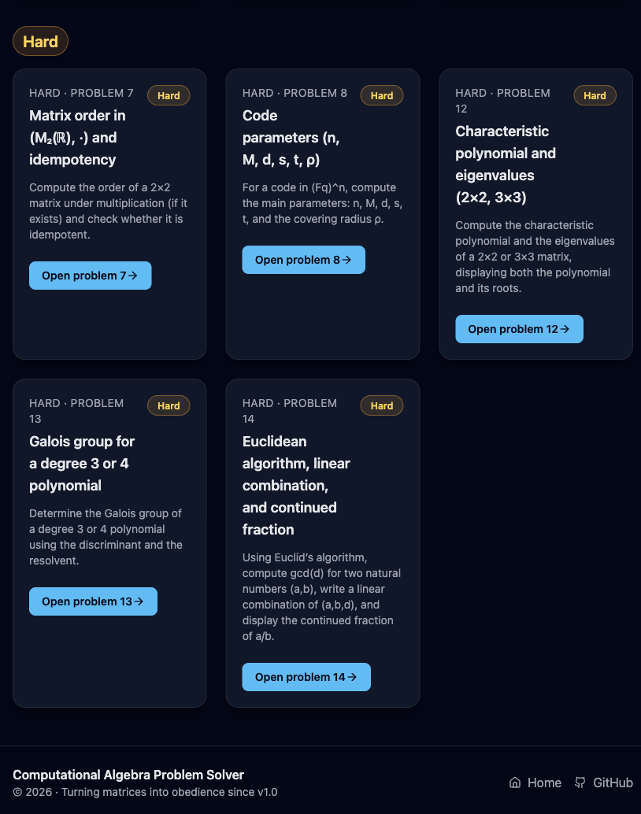
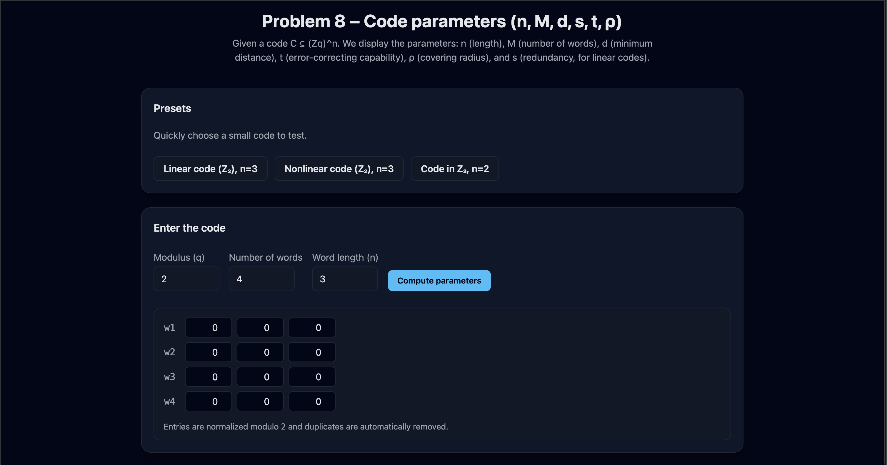
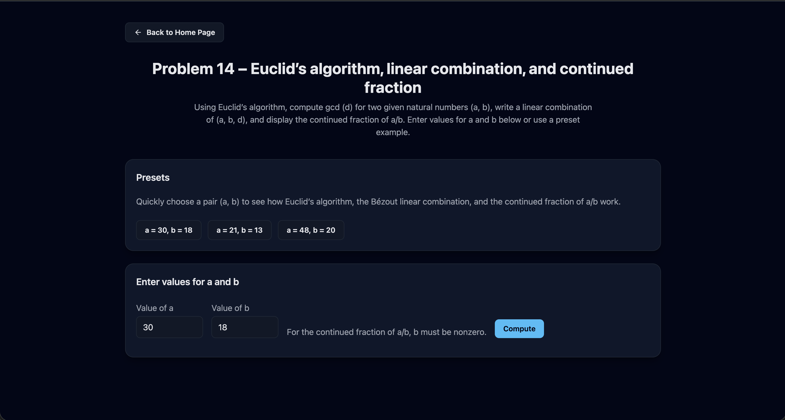
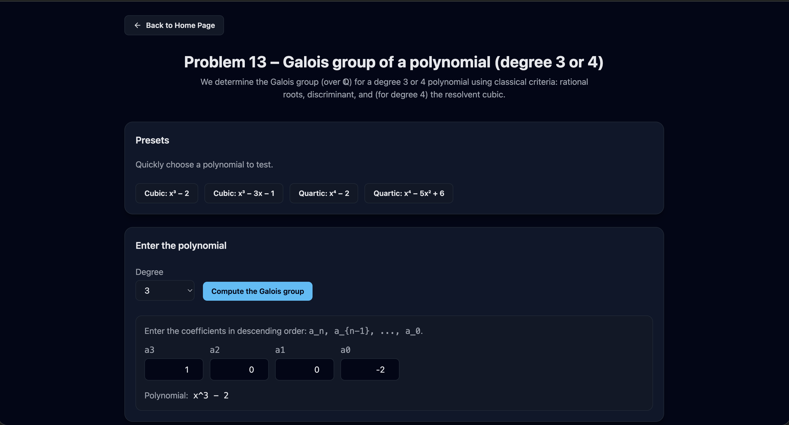
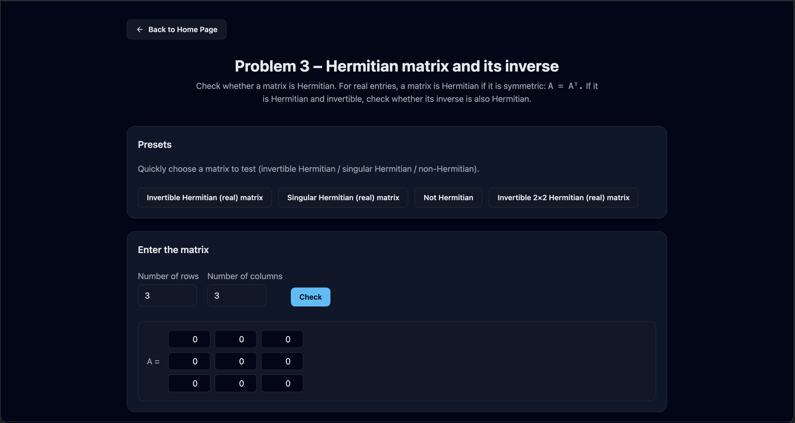
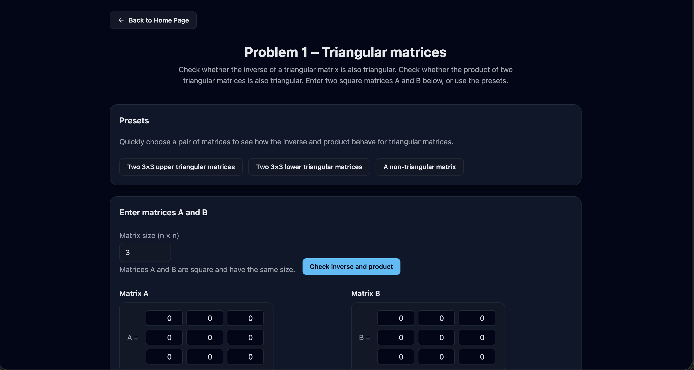

# ComputationalAlgebraAndCodingTheoryProblemSolver

An interactive web application for solving and exploring problems from Computational Algebra, Number Theory, Linear Algebra, and Coding Theory.

The platform provides step-by-step computations, predefined examples, and editable inputs so users can experiment with algorithms and better understand the mathematical procedures behind them.

The application supports Romanian and English, allowing the interface and explanations to switch instantly between languages.

## Table of Contents

- [Platform Preview](#platform-preview)
- [Features](#features)
  - [Interactive Mathematical Problem Solver](#interactive-mathematical-problem-solver)
  - [Bilingual Interface](#bilingual-interface)
  - [Algorithm Visualization](#algorithm-visualization)
- [Implemented Problems](#implemented-problems)
  - [Matrix Algebra](#matrix-algebra)
  - [Coding Theory](#coding-theory)
  - [Number Theory](#number-theory)
  - [Polynomial and Galois Theory](#polynomial-and-galois-theory)
- [Technologies Used](#technologies-used)
- [Internationalization](#internationalization)
- [Project Structure](#project-structure)
- [Algorithms Implemented](#algorithms-implemented)
- [Development](#development)
- [Educational Purpose](#educational-purpose)
- [License](#license)
- [Additional Resources](#additional-resources)

## Platform Preview

## Home Page




## Code Parameters



## Euclid Algorithm



## Galois Group



## Hermitian Matrix Inverse



## Triangular Matrices



## Features

### Interactive Mathematical Problem Solver

The application includes **14 implemented problems** covering multiple algebric topics.

Each problem page contains:

- explanation of the mathematical problem
- predefined example inputs
- editable user inputs
- algorithm steps
- computed results

## Bilingual Interface

The application supports two languages:

- Romanian
- English

All UI strings are managed using a JSON-based translation system.

## Algorithm Visualization

Instead of only showing final results, the platform displays:

- intermediate algorithm steps
- matrix computations
- Euclidean algorithm divisions
- coding theory parameters

This makes the application useful for learning and teaching.

## Implemented Problems

The system currently implements **14 problems**.

### Matrix Algebra

- Matrix inverse
- Hermitian matrix inverse
- Eigenvalues and characteristic polynomial

### Coding Theory

- Code parameter computation `(n, M, d, t, ρ)`
- Linear code verification
- Generator matrix codeword generation
- Parity-check matrix validation

### Number Theory

- Euclid's algorithm
- Extended Euclidean algorithm
- Bézout identity
- Continued fraction representation

### Polynomial and Galois Theory

- Galois group classification for degree 3 and 4 polynomials
- Discriminant analysis
- Resolvent cubic computation

## Technologies Used

### Frontend

- Angular 21
- TypeScript
- Tailwind CSS

### UI Components

- Lucide Angular icons
- Custom reusable layout components
- Responsive design

## Internationalization

Translation is handled using:

```
src/assets/i18n/
   ro.json
   en.json
```

A custom Angular pipe provides runtime translation switching.

## Project Structure

```
docs/
 ├── screenshots/
 ├── proposeProblemsENVersion.md
 └── proposeProblemsROVersion.md
public/
src/
 ├── app/
 │   ├── components/
 │   │   ├── footer/
 │   │   ├── navbar/
 │   ├── pages/
 │   │   ├── home/
 │   │   ├── not-found/
 │   │   └── problems/
 │   │        ├── problem1-triangular-matrices/
 │   │        ├── problem2-matrix-decomposition/
 │   │        └── ...
 │   │
 │   ├── pipes/
 │   │   └── translate.pipe.ts
 │   ├── services/
 │   │   ├── coding-theory.spec.ts
 │   │   ├── coding-theory.ts
 │   │   ├── i18n.spec.ts
 │   │   ├── i18n.ts
 │   │   ├── matrix-algebra.spec.ts
 │   │   ├── matrix-algebra.ts
 │   │   ├── modular-group.spec.ts
 │   │   ├── modular-group.ts
 │   │   ├── number-theory.spec.ts
 │   │   ├── number-theory.ts
 │   │   ├── polynomial-algebra.spec.ts
 │   │   └── polynomial-algebra.ts
 │   │
 │   ├── app.config.server.ts
 │   ├── app.config.ts
 │   ├── app.html
 │   ├── app.routes.server.ts
 │   ├── app.routes.ts
 │   ├── app.css
 │   ├── app.spec.ts
 │   └── app.ts
 │
 ├── assets/
 │   ├── i18n/
 │   └── images/
 │
 └── styles/
.gitignore
angular.json
docker-compose.yaml
Dockerfile
LICENSE
package.json
postcss.config.js
README.md
tailwind.config.js
tsconfig.app.json
tsconfig.json

```

## Algorithms Implemented

The platform implements classical algorithms used in algebra courses.

### Euclid's Algorithm

Computes the greatest common divisor using successive divisions.

```
a = q₀·b + r₀
b = q₁·r₀ + r₁
...

```

### Extended Euclidean Algorithm

Computes integers x and y satisfying:

```
ax + by = gcd(a,b)
```

(Bézout identity)

### Continued Fractions

A rational number can be written as:

```
a/b = [q₀; q₁, q₂, ...]
```

### Coding Theory Algorithms

Includes computation of:

- minimum distance
- code linearity
- generator matrix codewords
- parity-check validation

### Galois Group Classification

For cubic and quartic polynomials the system analyzes:

- rational roots
- discriminant
- resolvent cubic

to classify groups such as:

```
S3
A3
S4
A4
D4
V4
C4
```

## Development

This project was generated using [Angular CLI](https://github.com/angular/angular-cli) version 21.0.0.

Install dependencies

```bash
npm install
```

## Development server

To start a local development server, run:

```bash
ng serve
```

Once the server is running, open your browser and navigate to `http://localhost:4200/`.

The application will automatically reload whenever you modify any of the source files.

## Code scaffolding

Angular CLI includes powerful code scaffolding tools.

To generate a new component, run:

```bash
ng generate component component-name
```

For a complete list of available schematics (such as `components`, `directives`, or `pipes`), run:

```bash
ng generate --help
```

## Building

To build the project run:

```bash
ng build
```

This will compile your project and store the build artifacts in the `dist/` directory.

By default, the production build optimizes your application for performance and speed.

## Running unit tests

To execute unit tests with the [Karma](https://karma-runner.github.io) test runner, use the following command:

```bash
ng test
```

## Running end-to-end tests

For end-to-end (e2e) testing, run:

```bash
ng e2e
```

Angular CLI does not come with an end-to-end testing framework by default. You can choose one that suits your needs.

## Educational Purpose

This project was developed as part of coursework in Computational Algebra and Coding Theory

The goal is to provide an interactive platform that helps students understand the algorithms taught in the course.

## License

This project is intended for educational purposes.

## Additional Resources

For more information on using the Angular CLI, including detailed command references, visit the [Angular CLI Overview and Command Reference](https://angular.dev/tools/cli) page.
